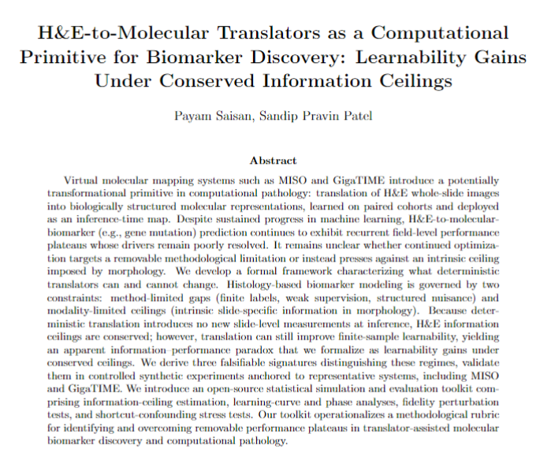

##

<div align="center">
  
</div>
 
##

# TRACE (Translator Representation Analysis of Ceilings and Efficiency)

TRACE is a simulation and analysis toolkit for studying when translator-derived proxy representations improve finite-sample biomarker prediction under conserved information ceilings.


For more information, see our paper:

**H&E-to-Molecular Translators as a Computational Primitive for Biomarker Discovery: Learnability Gains Under Conserved Information Ceilings**  
Payam Saisan, Sandip Pravin Patel  
**bioRxiv** *(link coming soon)*

This repository contains the code used to generate the simulation results, figures, and supporting analyses described in the following paper.


## Citation

If you use TRACE in your work, please reference the associated paper as follows:

Saisan, P., & Patel, S. P. (2026). *H\&E-to-Molecular Translators as a Computational Primitive for Biomarker Discovery: Learnability Gains Under Conserved Information Ceilings*. bioRxiv.


### BibTeX Entry

```bibtex
@article{saisan2026trace,
  author  = {Saisan, Payam and Patel, Sandip Pravin},
  title   = {H\&E-to-Molecular Translators as a Computational Primitive for Biomarker Discovery: Learnability Gains Under Conserved Information Ceilings},
  journal = {bioRxiv},
  year    = {2026},
  note    = {Preprint},
  url     = {\url{https://github.com/psaisan/TRACE}}
```


**Official companion repository for the bioRxiv paper:**  
**H\&E-to-Molecular Translators as a Computational Primitive for Biomarker Discovery: Learnability Gains Under Conserved Information Ceilings**  
**Payam Saisan, Sandip Pravin Patel**

TRACE is a simulation and analysis toolkit for studying a specific computational question in biomarker discovery: when can a learned translator from deployable morphology-derived representations to molecular-like proxy representations improve **finite-sample learnability**, even when deterministic translation cannot increase the underlying deployment-time information ceiling?

This repository contains the synthetic simulation framework, figure-generation pipeline, and analysis code associated with the paper. The purpose of the code is not to model histology realism directly, but to isolate and analyze the computational mechanism proposed in the manuscript: **translator-derived representations can improve downstream label-limited prediction by reorganizing existing information into a more learnable form, without creating new information at deployment**.

---

## Table of Contents

- [Background](#background)
- [Core Computational Question](#core-computational-question)
- [Analytical Flow of the Simulation Framework](#analytical-flow-of-the-simulation-framework)
- [Linear-Gaussian Benchmark](#linear-gaussian-benchmark)
- [Nonlinear Simulation Framework](#nonlinear-simulation-framework)
- [Robustness Across Nonlinear Sweep Families](#robustness-across-nonlinear-sweep-families)
- [Summary Metrics](#summary-metrics)
- [Threat Models and Failure Modes](#threat-models-and-failure-modes)
- [Repository Structure](#repository-structure)
- [Getting Started](#getting-started)
- [Citation](#citation)
- [License](#license)

---

## Background

Recent work in computational pathology has shown that H\&E images can carry predictive signal for molecular biomarkers. However, this predictive signal often appears to plateau below the performance of assays that measure molecular state more directly. This raises a central computational question:

> Can a model trained on paired data learn an intermediate representation that improves downstream biomarker prediction under realistic label scarcity, even if that intermediate cannot increase the underlying information content available at deployment?

The TRACE framework was developed to study this question directly.

Rather than treating H\&E-to-molecular translation as a purely generative goal, TRACE formalizes it as a **representation-learning primitive**. The key hypothesis is that a learned translator may not create new deployment-time information, but may nevertheless produce a representation with substantially better **finite-sample conditioning**, **sample efficiency**, and **learnability** for downstream biomarker tasks.

---

## Core Computational Question

The paper and this repository center on the following distinction:

- **Information ceiling:** the Bayes-optimal predictive limit available from the deployable representation `X`
- **Finite-sample learnability:** the practical ability of a downstream learner to approach useful prediction performance with a limited labeled sample budget

If a translator $$h(X)$$ is deterministic after paired-data training, then it cannot increase the deployment-time mutual information between $X$ and the target $Y$. Accordingly, any gain from prediction using $\hat Z = h(X)$ must be interpreted not as new information, but as improved **representation geometry for estimation under label scarcity

TRACE provides synthetic benchmarks to isolate exactly this effect.

---

## Analytical Flow of the Simulation Framework

The simulation framework follows the same logic as the paper and is organized around a four-stage progression.

### 1. Sanity checks for deterministic translation

The first stage establishes the theoretical baseline:

- a translator $$\hat Z = h(X)$$ is learned from paired samples $$(X, Z*)$$
- the translator is frozen after training
- because $$\hat Z$$ is deterministic in $$X$$, translation must obey the data-processing inequality
- therefore:
  - $$I(Y; \hat Z) <= I(Y; X)$$
  - $$AUC*(\hat Z) <= AUC*(X)$$

These checks ensure that any downstream improvement in performance from `\hat Z` must be interpreted as a **finite-sample learnability gain**, not as creation of new deployment-time signal.

### 2. Linear benchmark with structured nuisance

The second stage introduces a linear-Gaussian world designed to make the mechanism analytically transparent.

A low-dimensional biological state drives the target label, while the observed deployable representation `X` is formed by mixing:

- biological signal
- structured nuisance in a low-rank subspace
- isotropic observation noise

A translator is learned from paired samples `(X, Z*)`, frozen, and then compared against direct prediction from `X` under varying labeled sample budgets. This benchmark makes it possible to visualize:

- the asymptotic Bayes-optimal ceiling
- finite-sample learning curves
- fidelity dependence
- phase structure across nuisance strength and label budget

### 3. Nonlinear latent-world simulation

The third stage extends the framework beyond the linear regime.

In the nonlinear world:

- labels arise from a nonlinear function of latent biology
- the paired modality $$Z*$$ is still relatively aligned with task-relevant biology
- the deployable representation $$X$$ is higher-dimensional, nuisance-entangled, and more strongly distorted

This allows a more realistic regime in which the translated representation may be:

- **useful** in the low-label regime because it is easier to learn from
- **lossy** in the large-sample regime, so that direct prediction from `X` can eventually catch up or slightly exceed it

This nonlinear setting is critical because it separates two different effects:
- low-label representation advantage
- possible asymptotic cost of lossy translation

### 4. Robustness and scalar summaries

The fourth stage tests whether the learnability effect is robust across structured parameter sweeps rather than tied to a single tuned example.

Three sweep families are used:

- translator lossiness
- nuisance entanglement in the deployable representation
- paired-sample availability for learning the translator

The resulting learning curves are then summarized with compact scalar metrics such as:
- low-label gain
- crossover sample size
- tail-gap estimate

This final step converts many raw simulation curves into a compact view of when translator-based gains are strongest and when they degrade.

---

## Linear-Gaussian Benchmark

The linear benchmark is the analytically tractable core of TRACE.

### Generative structure

A latent biological state $Z^*$ determines the target label $Y$.  
The observed deployable feature vector `X` is generated by combining:

- a linear biological mixing term
- structured nuisance with controllable strength
- Gaussian observation noise

In this setting, the Bayes-optimal predictor in `X`-space can be characterized analytically, which provides a clean reference ceiling for comparison.

### Translator learning

Given paired samples $$(X_i, Z_i*)$$ , the translator is learned using regularized least squares:

- fit a map from $X$ to $Z*$
- freeze the translator
- use only the frozen translated representation $\hat Z = h(X)$ in downstream comparison

### Downstream task

For a fixed labeled budget `n_label`, two downstream learners are trained:

- an $$X$$-learner that predicts $$Y$$ directly from $$X$$
- a $$\hat Z$$-learner that predicts $Y$ from the translated representation

The central result is that $$\hat Z$$ can significantly outperform $$X$$ in the low-label regime, even though $$\hat Z$$ cannot exceed the asymptotic ceiling imposed by deterministic translation.

### Key outputs

The linear pipeline generates the main paper sanity and benchmark plots, including:

- DPI / mutual-information sanity checks
- Bayes ceiling comparisons
- finite-sample learning curves
- fidelity degradation analysis
- phase diagrams across nuisance and label budget
- site-shift shortcut threat tests

---

## Nonlinear Simulation Framework

The nonlinear TRACE simulations test whether the same phenomenon persists once the latent-to-observed mapping becomes more complex.

### Latent biology and nonlinear labels

A latent biological state `B` is sampled in a low-dimensional space.  
Binary labels are generated from a nonlinear score involving:

- a primary task-relevant axis
- an additional nonlinear latent direction
- optional quadratic structure
- optional label noise / ceiling limitation

This creates a controlled setting in which the true target is nonlinear in the latent biology.

### Paired biological modality

The paired target modality `Z*` is generated as a relatively direct nonlinear readout of the latent state. Depending on the experiment, it may contain:

- a signal block aligned with target-relevant biology
- optional weaker nuisance dimensions

Thus $$Z*$$ remains imperfect, but is generally better aligned with the target than raw $$X$$.

### Deployable representation

The deployable representation $$X$$ is generated from the same latent state but through a less favorable observation model:

- nonlinear compression
- quadratic distortion
- higher-dimensional mixing
- structured nuisance entanglement
- additive observation noise

Relative to $$Z*$$, this makes $$X$$ harder to use directly for downstream prediction under limited labels.

### Translator and downstream learning

A translator is fit from paired samples $$(X, Z*)$$ and frozen.  
Then, for varying `n_label`, separate logistic-regression classifiers are trained on:

- raw $$X$$
- translated $$\hat Z$$

This setup allows the translated representation to show a substantial low-label advantage while still potentially having a slightly lower large-`n` ceiling if translation is lossy.

---

## Robustness Across Nonlinear Sweep Families

To determine whether translator-based learnability gains are stable rather than fragile, TRACE evaluates three nonlinear sweep families.

### 1. Translator lossiness

This sweep varies how much task-relevant structure the learned translator preserves by altering:

- paired-modality noise
- translated dimensionality
- translator regularization
- paired-data size

This sweep tests how much low-label benefit survives as translation quality degrades.

### 2. Nuisance entanglement in $$X$$

This sweep varies how difficult the raw deployable representation is to use directly by modifying:

- nuisance rank
- nuisance amplitude
- nonlinear distortion strength in $$X$$

This sweep is especially important because the paper’s proposed mechanism predicts that translator-based gains should become stronger as raw `X` becomes more weakly conditioned.

### 3. Paired-sample availability

This sweep varies the amount of paired data available to train the translator itself.

This tests whether a useful translator can still provide finite-sample benefits when the paired-data regime is limited, and where those benefits begin to break down.

### Overall qualitative pattern

Across all three sweep families, the same computational pattern is expected and observed:

- `\hat Z` tends to outperform `X` at low label budgets
- direct prediction from `X` improves more slowly
- `X` catches up later, sometimes only at very large sample sizes
- in lossy regimes, `X` may eventually slightly exceed `\hat Z`

This is the defining signature of TRACE: **finite-sample advantage under conserved information ceilings**.

---

## Summary Metrics

To compactly compare nonlinear conditions, TRACE summarizes learning curves using scalar metrics derived from the paper.

### Low-label gain

This metric averages the difference:

$$AUC_n(\hat Z) - AUC_n(X)$$

over the first few labeled-sample grid points.

Positive values indicate that the translated representation provides a systematic advantage in the low-label regime.

### Crossover sample size

This is the first labeled sample size at which direct prediction from `X` matches or exceeds prediction from $$\hat Z$$, if a crossover occurs within the simulated range.

It provides a simple estimate of how long the translator-derived representation remains advantageous.

### Tail-gap estimate

This metric averages:

$$AUC_n(\hat Z) - AUC_n(X)$$

over the final few grid points.

- near zero suggests comparable large-sample behavior
- negative values suggest that direct prediction from `X` eventually exceeds the translated representation
- more negative values are consistent with more lossy translation

These summary metrics provide a compact way to compare many nonlinear conditions without relying only on raw learning-curve inspection.

---

## Threat Models and Failure Modes

Observed gains from translated intermediates do not automatically imply biology-aligned or deployment-relevant signal. TRACE therefore includes explicit threat-model logic.

### Main failure modes

#### Translator confounding
The translated representation may encode site, stain, scanner, or acquisition artifacts correlated with the target.

#### Prior hallucination
The translator may generate a representation that appears biologically meaningful while remaining poorly calibrated or partially synthetic in a misleading way.

#### Evaluation circularity
If translators or hyperparameters are selected using downstream test performance, apparent gains may be inflated.

### Minimal shortcut stress test

TRACE includes a site-shift threat model in which:

- nuisance components in `X` correlate with site
- site correlates with labels in the labeled dataset
- the paired-data mixture used to train the translator differs from the evaluation mixture

In this regime, translated representations can appear beneficial under random-split evaluation while degrading or reversing under deployment-like site-stratified shift.

This distinguishes:
- genuine biology-aligned learnability gains
from
- shortcut amplification through confounded structure

### Mitigation principles

The paper and code emphasize the following safeguards:

- site-stratified evaluation
- frozen translator selection
- controlled fidelity degradation tests
- calibration against measured modalities when available
- separation of translator training from downstream label evaluation

---
