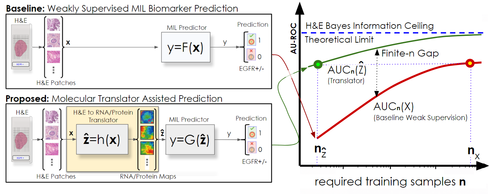

# TRACE
**Translator Representation Analysis of Ceilings and Efficiency**

TRACE is a simulation and analysis toolkit for studying when translator-derived proxy representations improve finite-sample biomarker prediction under conserved information ceilings.


For more information, see our paper:

**H&E-to-Molecular Translators as a Computational Primitive for Biomarker Discovery: Learnability Gains Under Conserved Information Ceilings**  
Payam Saisan, Sandip Pravin Patel  
**bioRxiv** *(link coming soon)*

This repository contains the code used to generate the simulation results, figures, and supporting analyses described in the following paper.


## Citation

If you use TRACE in your work, please reference the associated paper as follows:

Saisan, P., & Patel, S. P. (2026). *H\&E-to-Molecular Translators as a Computational Primitive for Biomarker Discovery: Learnability Gains Under Conserved Information Ceilings*. bioRxiv.


### BibTeX Entry

```bibtex
@article{saisan2026trace,
  author  = {Saisan, Payam and Patel, Sandip Pravin},
  title   = {H\&E-to-Molecular Translators as a Computational Primitive for Biomarker Discovery: Learnability Gains Under Conserved Information Ceilings},
  journal = {bioRxiv},
  year    = {2026},
  note    = {Preprint},
  url     = {\url{https://github.com/psaisan/TRACE}}
}


